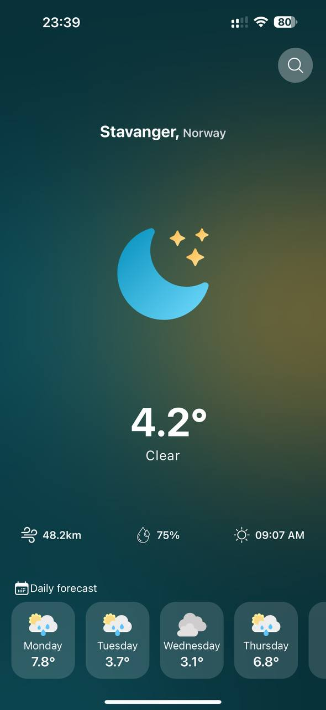
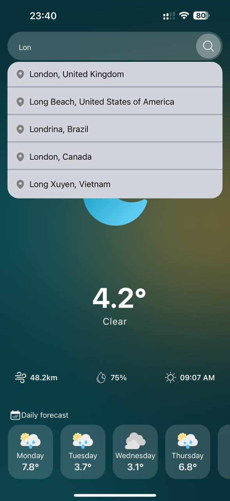

# 🌤 Weather App

> A real-time weather viewing application built using React Native and Expo.

## 📋 Description

**Weather App** is a modern application that provides users with up-to-date weather information for any city. Its simple interface and rich functionality make it a convenient and useful tool for everyday life.

## 🚀 Features

- 🔍 **City Search**: Quickly search for the weather in any city using the search bar.
- 🌤 **Detailed Weather Information**: Displays temperature, wind speed, precipitation probability, and sunrise time.
- 📆 **Weather Forecast**: A slider with a weather forecast for several days ahead.
- 💾 **City Saving**: Automatically saves the last selected city using `@react-native-async-storage/async-storage`.
- 📡 **Connection Loss Alerts**: A modal window warns the user when the internet connection is lost (using `@react-native-community/netinfo`).
- 🌙 **Aesthetic Interface**: Minimalistic design styled with Tailwind via `NativeWind`.
- 🎨 **Beautiful Icons**: Displays weather icons using `react-native-heroicons`.

## 🛠 Technologies Used

- [Expo](https://expo.dev/)
- [React Native](https://reactnative.dev/)
- [TypeScript](https://www.typescriptlang.org/)
- [Axios](https://axios-http.com/) — for making API requests.
- [NativeWind](https://www.nativewind.dev/) — styling using Tailwind.
- [WeatherAPI](https://www.weatherapi.com/) — for fetching weather data.
- [expo-router](https://expo.github.io/router/) — for in-app routing.
- [@react-native-async-storage/async-storage](https://github.com/react-native-async-storage/async-storage) — for data storage.
- [@react-native-community/netinfo](https://github.com/react-native-netinfo/react-native-netinfo) — for managing internet connection state.
- [react-native-heroicons](https://github.com/erictheise/react-native-heroicons) — beautiful icons for the app.

## 📦 Installation

1. Clone the repository:

   ```bash
   git clone https://github.com/Senriv/Weather.git
   cd Weather

   ```

2. Install dependencies:

   ```bash
   npm install

   ```

3. Start the project:

   ```bash
   npm start

   ```

4. Open the app on a device or emulator by scanning the QR code via Expo Go.

## 🖼 Screenshots

<div style="display: flex; justify-content: center; gap: 10px;">
  
  
</div>

## 🌍 API

The app uses [WeatherAPI](https://www.weatherapi.com/) to fetch weather data.

## 👤 Author

**Senriv**

- [GitHub](https://github.com/Senriv)
- [LinkedIn](https://www.linkedin.com/in/borysenko-vitalii/)
- 📧 Email: [borysenko.vitalii00@gmail.com](borysenko.vitalii00@gmail.com)
